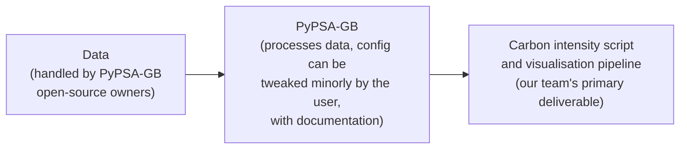

# Methodology

## Weeks 1 to 3

We have been running PyPSA with essentially default configuration, on local
machines, with an LP solve or the Gurobi solver. Compute is benchmarked on
each run. This benchmarking is itself a useful deliverable: it investigates
the tractability constraints of using PyPSA within a carbon-intensity,
industry-level project.

## Running PyPSA-GB

The user runs PyPSA-GB with a dataset contained within PyPSA-GB, imported
within the conda environment using the tools provided.

Our current helper for evaluating results is NESO actual historical API data.
This is an optional step.

The true result to investigate is the topology changes, set against NESO's
current working 14-region model, to enable more granularity and to investigate
interesting results based on transmission constraints and greater granularity.
The intention is to move from a 32-bus network as a minimum viable product up
to a 2000-bus network, to find a sweet spot.

## Pipeline

The output from PyPSA is a solved network file in NetCDF format (a `.nc` file,
for example `<scenario>_solved.nc`). The user then runs the carbon intensity
script on this output. The input is the solved `.nc` network file, and the
output is a CSV of hourly system carbon intensity in gCO2 per kWh
(`system_carbon_intensity.csv`). This is documented in this GitHub repository.
This data is then taken for further visualisation.

The pipeline has three stages, each owned by a different party:

