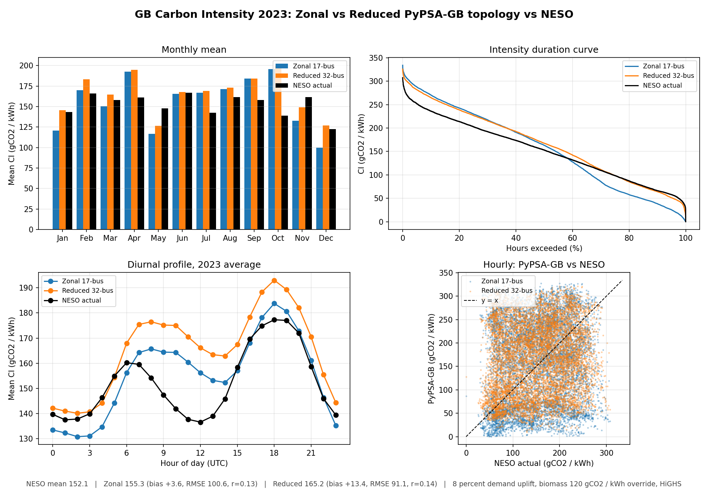

# Week 2 — 2023 full-year, 17-bus vs 32-bus, NESO-aligned

## Headline result

| Series | Annual mean (gCO2 / kWh) | Bias vs NESO | RMSE | MAE | Pearson r |
|---|---|---|---|---|---|
| NESO 2023 actual    | 152.1 | -                     | -     | -    | -    |
| Zonal 17-bus uplift | 155.3 | +3.6 (+2.4 percent)   | 100.6 | 82.3 | 0.13 |
| Reduced 32-bus uplift | 165.2 | +13.4 (+8.8 percent) |  91.1 | 73.7 | 0.14 |

Aligned on 8713 common hourly snapshots out of 8760 in 2023.

## What was done

### Task 1: real-world variables
- **Transmission losses (8 percent).** Applied as a uniform demand-side
  uplift: every load is multiplied by `1 / (1 - 0.08) = 1.087` before
  solve. This matches NESO's convention that the published intensity is
  per kWh **delivered**.
- **Biomass emission factor (120 gCO2 / kWh electrical).** Applied at
  post-processing in `Scripts/carbon_intensity.py` via
  `NESO_FACTORS_G_PER_KWH`. The override is electrical (sent-out) and
  bypasses the thermal-to-electrical efficiency conversion that the
  default code applies. Covers `biomass`, `Bioenergy`, `biogas`,
  `landfill_gas`, `sewage_gas`, `advanced_biofuel`, since NESO's
  single "Biomass" 120 covers all biogenic combustion.
- PyPSA-GB `carrier_definitions.py` is **not** modified — the LP
  dispatch uses upstream defaults, only the post-processing accounting
  deviates. Keeps the clone clean.

### Task 2: 17-zone vs 32-bus, full year
- Scenarios `Historical_2023_zonal_year` and
  `Historical_2023_reduced_year` added to PyPSA-GB's
  `config/scenarios.yaml` (both 2023-01-01 to 2023-12-31, 8760 hourly
  snapshots).
- HiGHS solver throughout. Wall times on 12700KF / 32 GB:

  | Step | Zonal | Reduced |
  |---|---|---|
  | Baseline solve | 39:32 | 44:40 |
  | Uplift re-solve | 34:30 | 44:33 |

- 8760 snapshots, ~80-190 MB output NetCDFs per scenario, ~9-16 GB peak
  RAM in solve.
- Annual total generation: 272.5 TWh (Zonal), 273.0 TWh (Reduced).
  Within 1 percent of GB's actual 2023 consumption.

### Task 3: pipeline
Single-module pipeline in `Scripts/`:
- `carbon_intensity.py` — post-processor. Reads a solved `.nc`, writes
  three standard CSVs (`system_summary`, `generation_intensity`,
  `consumption_intensity`). `--neso-overrides` flag toggles the
  biomass-class override.
- `solve_with_uplift.py` — driver: load a solved network, scale loads
  by the loss factor, re-solve. Writes `manifest.json` with input SHA,
  loss fraction, solver wall time.
- `visualise.py` — accepts any number of `LABEL=PATH` pairs and an
  optional NESO CSV. Writes a fixed plot pack (time series, monthly
  bar, duration curve, diurnal, scatter) and `summary_stats.csv`.
- `make_headline.py` — single composite figure for slide use.
- `pull_neso_2023.py` — NESO API puller (already used to populate
  `Data/`).

The four Week-1 duplicate scripts in `Scripts/` are not removed in this
commit. Their replacement is the new `carbon_intensity.py`; the team
should agree on the deletion before pushing it.

Inputs are in `Data/`; pipeline scripts in `Scripts/`; methodology
documents in `Docs/`.

